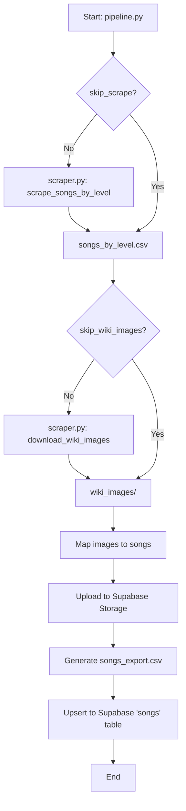

# Arcaea Charts (Fandom) Data

Single scraper for Arcaea Fandom wiki data. Uses the MediaWiki API only (no direct HTML scraping) to avoid blocks.

```bash
# Scrape the Songs by Level page → CSV (Song, Artist, Difficulty, Chart Constant, Level, Version)
python scraper.py songs-by-level -o songs_by_level.csv

# Fetch specific song pages (chart info + jacket URLs) → individual_songs.csv
python scraper.py song-pages

# Download all song jacket images from Category:Songs into wiki_images/
python scraper.py wiki-images
```

## Modes

| Mode | Description |
|------|-------------|
| `songs-by-level` | Scrapes [Songs by Level](https://arcaea.fandom.com/wiki/Songs_by_Level): one row per chart (song, artist, difficulty, chart constant, level, version). |
| `song-pages` | Fetches listed song wiki pages via API; parses chart info and jacket (incl. BYD/Beyond). Writes `individual_songs.csv`. |
| `wiki-images` | Gets all pages in Category:Songs, extracts jacket (and Beyond) image URLs, downloads each unique image to `wiki_images/`. |

## Options

- `--output`, `-o` – Output CSV path (for `songs-by-level` or `song-pages`).
- `--delay` – Seconds between API requests (default: 2).
- `--dir` – Download directory for `wiki-images` (default: `wiki_images`).

## Updating image URLs in a CSV

After downloading wiki images, you can point song rows’ `imageUrl` to local files by title:

```bash
python update_image_urls.py --csv your_songs.csv --images wiki_images -o your_songs_updated.csv
```

The script matches CSV `title` to filenames in `wiki_images/`, including URL-encoded names (e.g. `ΟΔΥΣΣΕΙΑ` → `_CE_9F_CE_94_...jpg`) and normalizes subscript/superscript digits (e.g. `INCARNATOR₀₀` → `INCARNATOR_00.jpg`). Use `--title-column` and `--image-column` if your CSV uses different column names.

If your shell prints `_encode: command not found` when running Python, run the command under bash:  
`/bin/bash -c 'python3 update_image_urls.py ...'`

## Full pipeline (scrape → wiki images → Supabase)

One command to scrape Songs by Level, download wiki images, upload jacket images to Supabase Storage, and upsert rows into the `songs` table:

```bash
python pipeline.py
```



Optional: `--skip-scrape` to reuse existing `songs_by_level.csv`; `--skip-wiki-images` to skip downloading images. Requires `SUPABASE_URL` and `SUPABASE_SERVICE_ROLE_KEY` in the environment or in `.env` (anon key cannot write due to RLS).

## GitHub Actions (automated sync)

The pipeline can run on a schedule or on demand via GitHub Actions. The workflow uses the **PROD** environment.

- **Triggers:** Daily at 4:00 UTC (cron) and manual run from the Actions tab (`workflow_dispatch`).
- **PROD environment:** In **Settings → Secrets and variables → Actions**, open **Environments** and select **PROD**. Then:
  - **Variables:** `SUPABASE_URL`, `SUPABASE_SERVICE_ROLE_KEY`.

Do not commit `.env`; the workflow uses these secrets as environment variables. After pushing the workflow file (`.github/workflows/sync-songs.yml`) and setting secrets, run the “Sync songs to Supabase” workflow once manually from the Actions tab to verify.

## Development and linting

- **Lint:** Run `pylint scraper.py pipeline.py update_image_urls.py`. The project uses [.pylintrc](.pylintrc) (e.g. `max-line-length=120`). Fix all errors and warnings before committing.
- **CI:** The [Lint](.github/workflows/lint.yml) workflow runs pylint on every push and pull request. The [Sync songs to Supabase](.github/workflows/sync-songs.yml) workflow also runs pylint before the pipeline so scheduled and manual syncs fail fast if the code doesn’t pass lint.
- **Pre-commit (optional):** To run pylint automatically before each commit, install [pre-commit](https://pre-commit.com/) and add a local hook that runs the pylint command above.
- **AI / agents:** The repo includes [.cursor/rules/lint-and-style.mdc](.cursor/rules/lint-and-style.mdc) so Cursor (and similar tools that read project rules) are instructed to run pylint and follow the project’s style when editing Python.
